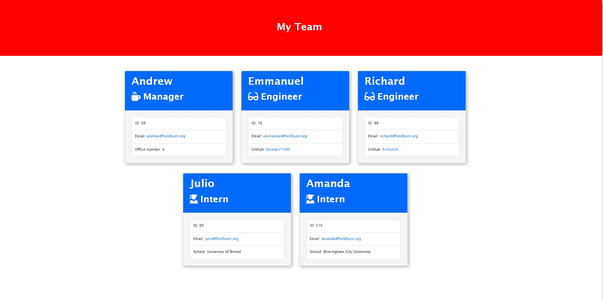

# Team-Profile-Generator



## Description
The code in this repository generates a team's profile page from inputs added by the user via the terminal. The inquirer module grabs user input, while the file system module creates the files.  This application prompts for team members which include a manager, engineers and interns. A live demo can be found [here](https://emman77240.github.io/Team-Profile-Generator/).


## Installation

1. To install this application in your local machine, clone the main project using the command below.

```
git clone
```

2. Once the project has been fully cloned, open up the project folder in your preferred text editor and run the following command in the terminal to install all dependencies.

```
npm install
```

## Usage

1. While in the main project folder, run the command below to start the application. Please respond to prompts as they appear:

```
node index
```

2. Give answers to all the prompts. Your HTML file will be created once the answers have been provided.

## Testing

You can test the functions in this application using the node package "Jest". Run the command below to start test:

```
npm run test
```


## Built With

- Node.js
- File system module (fs)
- Inquirer module
- JavaScript
- CSS


## License

MIT License.